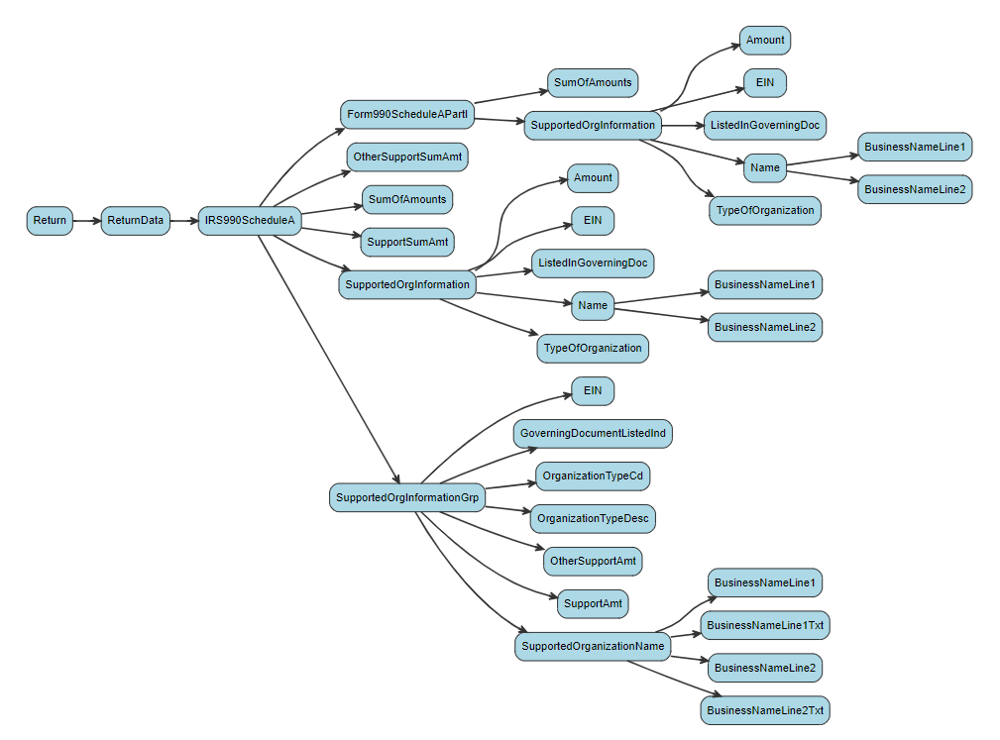

# efile-rdb-tables

Build scripts and documentation of the one-to-many tables in the IRS 990 efile database.

Each RDB table has a unique structure and many are "pathological" according to strict XML standards, so extracting one-to-many tables is challenging. 

The solution is creating a report that documents table structure across all of the efile schemas for 990 and 990EZ filers. It will attempt to build the one-to-many tables from the 990 and 990EZ forms using package defaults and log errors like problematic XML table structures (data stored at multiple levels of the form), missing xpaths that occur in the tables but not in the concordance file, and problematic URLs. 

Example reports: 

* [F9-P07-T01-COMPENSATION](https://nonprofit-open-data-collective.github.io/efile-rdb-tables/table-report-template-demo.html)
* [F9-P03-T01-PROGRAMS](https://nonprofit-open-data-collective.github.io/efile-rdb-tables/TABLE-F9-P03-T01-PROGRAMS.html)
* [SA-P01-T01-PUBLIC-CHARITY-STATUS](https://nonprofit-open-data-collective.github.io/efile-rdb-tables/TABLE-SA-P01-T01-PUBLIC-CHARITY-STATUS.html)

## The efile package **irs990efile**: 

You will need the following custom packages to run the report: 

```r
devtools::install_github( 'ultinomics/xmltools' )
devtools::install_github( 'nonprofit-open-data-collective/irs990efile' )
```

To re-run all of the reports above downoad this repo and use the file called [**batch.rmd**](https://github.com/Nonprofit-Open-Data-Collective/efile-rdb-tables/blob/main/batch.rmd).

It runs the report for every table with the RMD template called [table-report-template-batch.rmd](https://github.com/Nonprofit-Open-Data-Collective/efile-rdb-tables/blob/main/table-report-template-batch.rmd). 

```r
# EXAMPLE WITH ONE TABLE 

sample.size <- 1000

## F9-P08-T01-REVENUE-PROGRAMS
table.name <- "F9-P08-T01-REVENUE-PROGRAMS"
folder.name <- paste0( "TABLE-", table.name )
table.headers <- NULL
index <- 
  tinyindex %>% 
  dplyr::filter( FormType %in% c("990","990EZ") )
  
try(  
  rmarkdown::render( input='table-report-template-batch.rmd', 
                     output_file = "TABLE-F9-P08-T01-REVENUE-PROGRAMS",
                     params = list( table.name = table.name, folder.name = folder.name, table.headers = table.headers, index = index  ) )
)
```


If table.headers is NULL the program tries to guess the correct headers. If that fails they have been added manually. 

Since most nonprofits do not file most schedules there are custom samples of 990 filers for reports created about schedule tables. 

https://github.com/Nonprofit-Open-Data-Collective/efile-rdb-tables/tree/main/schedule-samples

---------------


## Table Structure

Reports start with a 1:M table that is present on the 990 form using tables names that are listed in the condordance files. The report gather all xpaths associated with the table across all XML versions. The goal is to convert the hierarchical XML version of the data into a flat, rectangular CSV file. The report includes tree diagrams of the table structure that can help diagnose parsing problems. 

In this example the table name and table headers would be: 

```
## SA-P01-T01-PUBLIC-CHARITY-STATUS
table.name <- "SA-P01-T01-PUBLIC-CHARITY-STATUS"
 table.headers <- 
  c("//Form990ScheduleAPartI/SupportedOrgInformation",
    "//IRS990ScheduleA/SupportedOrgInformation",
    "//IRS990ScheduleA/SupportedOrgInformationGrp")
```




---------------


## All Reports

* [TABLE-F9-P03-T01-PROGRAMS.html](https://nonprofit-open-data-collective.github.io/efile-rdb-tables/TABLE-F9-P03-T01-PROGRAMS.html)  
* [TABLE-F9-P07-T01-COMPENSATION-HCE-EZ.html](https://nonprofit-open-data-collective.github.io/efile-rdb-tables/TABLE-F9-P07-T01-COMPENSATION-HCE-EZ.html)  
* [TABLE-F9-P07-T01-COMPENSATION.html](https://nonprofit-open-data-collective.github.io/efile-rdb-tables/TABLE-F9-P07-T01-COMPENSATION.html)  
* [TABLE-F9-P07-T02-CONTRACTORS.html](https://nonprofit-open-data-collective.github.io/efile-rdb-tables/TABLE-F9-P07-T02-CONTRACTORS.html)  
* [TABLE-F9-P08-T01-REVENUE-PROGRAMS.html](https://nonprofit-open-data-collective.github.io/efile-rdb-tables/TABLE-F9-P08-T01-REVENUE-PROGRAMS.html)  
* [TABLE-F9-P08-T02-REVENUE-MISC.html](https://nonprofit-open-data-collective.github.io/efile-rdb-tables/TABLE-F9-P08-T02-REVENUE-MISC.html)  
* [TABLE-F9-P09-T01-EXPENSES-OTHER.html](https://nonprofit-open-data-collective.github.io/efile-rdb-tables/TABLE-F9-P09-T01-EXPENSES-OTHER.html)  
* [TABLE-F9-P99-T01-COMPENSATION.html](https://nonprofit-open-data-collective.github.io/efile-rdb-tables/TABLE-F9-P99-T01-COMPENSATION.html)  
* [TABLE-SA-P01-T01-PUBLIC-CHARITY-STATUS.html](https://nonprofit-open-data-collective.github.io/efile-rdb-tables/TABLE-SA-P01-T01-PUBLIC-CHARITY-STATUS.html)  
* [TABLE-SA-P99-T01-PUBLIC-CHARITY-STATUS.html](https://nonprofit-open-data-collective.github.io/efile-rdb-tables/TABLE-SA-P99-T01-PUBLIC-CHARITY-STATUS.html)  
* [TABLE-SC-P01-T01-POLITICAL-ORGS-INFO.html](https://nonprofit-open-data-collective.github.io/efile-rdb-tables/TABLE-SC-P01-T01-POLITICAL-ORGS-INFO.html)  
* [TABLE-SD-P07-T01-INVESTMENTS-OTH-SECURITIES.html](https://nonprofit-open-data-collective.github.io/efile-rdb-tables/TABLE-SD-P07-T01-INVESTMENTS-OTH-SECURITIES.html)  
* [TABLE-SD-P08-T01-INVESTMENTS-PROG-RLTD.html](https://nonprofit-open-data-collective.github.io/efile-rdb-tables/TABLE-SD-P08-T01-INVESTMENTS-PROG-RLTD.html)  
* [TABLE-SD-P09-T01-OTH-ASSETS.html](https://nonprofit-open-data-collective.github.io/efile-rdb-tables/TABLE-SD-P09-T01-OTH-ASSETS.html)  
* [TABLE-SF-P01-T01-FRGN-ACTS-BY-REGION.html](https://nonprofit-open-data-collective.github.io/efile-rdb-tables/TABLE-SF-P01-T01-FRGN-ACTS-BY-REGION.html)  
* [TABLE-SF-P02-T01-FRGN-ORG-GRANTS.html](https://nonprofit-open-data-collective.github.io/efile-rdb-tables/TABLE-SF-P02-T01-FRGN-ORG-GRANTS.html)  
* [TABLE-SF-P03-T01-FRGN-INDIV-GRANTS.html](https://nonprofit-open-data-collective.github.io/efile-rdb-tables/TABLE-SF-P03-T01-FRGN-INDIV-GRANTS.html)  
* [TABLE-SG-P01-T01-FUNDRAISERS-INFO.html](https://nonprofit-open-data-collective.github.io/efile-rdb-tables/TABLE-SG-P01-T01-FUNDRAISERS-INFO.html)  
* [TABLE-SG-P02-T01-FUNDRAISING-EVENTS.html](https://nonprofit-open-data-collective.github.io/efile-rdb-tables/TABLE-SG-P02-T01-FUNDRAISING-EVENTS.html)  
* [TABLE-SH-P04-T01-COMPANY-JOINT-VENTURES.html](https://nonprofit-open-data-collective.github.io/efile-rdb-tables/TABLE-SH-P04-T01-COMPANY-JOINT-VENTURES.html)  
* [TABLE-SH-P05-T01-HOSPITAL-FACILITY.html](https://nonprofit-open-data-collective.github.io/efile-rdb-tables/TABLE-SH-P05-T01-HOSPITAL-FACILITY.html)  
* [TABLE-SH-P05-T02-NON-HOSPITAL-FACILITY.html](https://nonprofit-open-data-collective.github.io/efile-rdb-tables/TABLE-SH-P05-T02-NON-HOSPITAL-FACILITY.html)  
* [TABLE-SI-P02-T01-GRANTS-US-ORGS-GOVTS.html](https://nonprofit-open-data-collective.github.io/efile-rdb-tables/TABLE-SI-P02-T01-GRANTS-US-ORGS-GOVTS.html)  
* [TABLE-SI-P03-T01-GRANTS-US-INDIV.html](https://nonprofit-open-data-collective.github.io/efile-rdb-tables/TABLE-SI-P03-T01-GRANTS-US-INDIV.html)  
* [TABLE-SJ-P02-T01-COMPENSATION-DTK.html](https://nonprofit-open-data-collective.github.io/efile-rdb-tables/TABLE-SJ-P02-T01-COMPENSATION-DTK.html)  
* [TABLE-SK-P01-T01-BOND-ISSUES.html](https://nonprofit-open-data-collective.github.io/efile-rdb-tables/TABLE-SK-P01-T01-BOND-ISSUES.html)  
* [TABLE-SK-P02-T01-BOND-PROCEEDS.html](https://nonprofit-open-data-collective.github.io/efile-rdb-tables/TABLE-SK-P02-T01-BOND-PROCEEDS.html)  
* [TABLE-SK-P03-T01-BOND-PRIVATE-BIZ-USE.html](https://nonprofit-open-data-collective.github.io/efile-rdb-tables/TABLE-SK-P03-T01-BOND-PRIVATE-BIZ-USE.html)  
* [TABLE-SK-P04-T01-BOND-ARBITRAGE.html](https://nonprofit-open-data-collective.github.io/efile-rdb-tables/TABLE-SK-P04-T01-BOND-ARBITRAGE.html)  
* [TABLE-SK-P05-T01-PROCEDURE-CORRECTIVE-ACT.html](https://nonprofit-open-data-collective.github.io/efile-rdb-tables/TABLE-SK-P05-T01-PROCEDURE-CORRECTIVE-ACT.html)  
* [TABLE-SL-P01-T01-EXCESS-BENEFIT-TRANSAC.html](https://nonprofit-open-data-collective.github.io/efile-rdb-tables/TABLE-SL-P01-T01-EXCESS-BENEFIT-TRANSAC.html)  
* [TABLE-SL-P02-T01-LOANS-INTERESTED-PERS.html](https://nonprofit-open-data-collective.github.io/efile-rdb-tables/TABLE-SL-P02-T01-LOANS-INTERESTED-PERS.html)  
* [TABLE-SL-P03-T01-GRANTS-INTERESTED-PERS.html](https://nonprofit-open-data-collective.github.io/efile-rdb-tables/TABLE-SL-P03-T01-GRANTS-INTERESTED-PERS.html)  
* [TABLE-SL-P04-T01-BIZ-TRANSAC-INTERESTED-PERS.html](https://nonprofit-open-data-collective.github.io/efile-rdb-tables/TABLE-SL-P04-T01-BIZ-TRANSAC-INTERESTED-PERS.html)  
* [TABLE-SM-P01-T01-NONCASH-CONTRIBUTIONS.html](https://nonprofit-open-data-collective.github.io/efile-rdb-tables/TABLE-SM-P01-T01-NONCASH-CONTRIBUTIONS.html)  
* [TABLE-SN-P01-T01-LIQUIDATION-TERMINATION-DISSOLUTION.html](https://nonprofit-open-data-collective.github.io/efile-rdb-tables/TABLE-SN-P01-T01-LIQUIDATION-TERMINATION-DISSOLUTION.html)  
* [TABLE-SN-P02-T01-DISPOSITION-OF-ASSETS.html](https://nonprofit-open-data-collective.github.io/efile-rdb-tables/TABLE-SN-P02-T01-DISPOSITION-OF-ASSETS.html)  
* [TABLE-SO-T99-SUPPLEMENTAL-INFO.html](https://nonprofit-open-data-collective.github.io/efile-rdb-tables/TABLE-SO-T99-SUPPLEMENTAL-INFO.html)  
* [TABLE-SR-P01-T01-ID-DISREGARDED-ENTITIES.html](https://nonprofit-open-data-collective.github.io/efile-rdb-tables/TABLE-SR-P01-T01-ID-DISREGARDED-ENTITIES.html)  
* [TABLE-SR-P02-T01-ID-RLTD-TAX-EXEMPED-ORGS.html](https://nonprofit-open-data-collective.github.io/efile-rdb-tables/TABLE-SR-P02-T01-ID-RLTD-TAX-EXEMPED-ORGS.html)  
* [TABLE-SR-P03-T01-ID-RLTD-ORGS-TAXABLE-PARTNERSHIP.html](https://nonprofit-open-data-collective.github.io/efile-rdb-tables/TABLE-SR-P03-T01-ID-RLTD-ORGS-TAXABLE-PARTNERSHIP.html)  
* [TABLE-SR-P04-T01-ID-RLTD-ORGS-TAXABLE-CORPORATION.html](https://nonprofit-open-data-collective.github.io/efile-rdb-tables/TABLE-SR-P04-T01-ID-RLTD-ORGS-TAXABLE-CORPORATION.html)  
* [TABLE-SR-P05-T01-TRANSACTIONS-RLTD-ORGS.html](https://nonprofit-open-data-collective.github.io/efile-rdb-tables/TABLE-SR-P05-T01-TRANSACTIONS-RLTD-ORGS.html)  
* [TABLE-SR-P06-T01-UNRLTD-ORGS-TAXABLE-PARTNERSHIP.html](https://nonprofit-open-data-collective.github.io/efile-rdb-tables/TABLE-SR-P06-T01-UNRLTD-ORGS-TAXABLE-PARTNERSHIP.html) 


```r
# create markdown list of reports
f <- dir()
reports <- f[ grepl( ".html", f ) ]
root.url <- "https://nonprofit-open-data-collective.github.io/efile-rdb-tables/"

create_bullet <- function( table.name )
{
  bullet <- paste0( "* [", table.name, "](", root.url, table.name ")  \n" )
  return( bullet )
}

for( i in reports )
{ cat( create_bullet( i ) ) }
```


---------------


## DEMO BUILD SCRIPT

```r
# INSTALL PACKAGES
# devtools::install_github( 'ultinomics/xmltools' )
# devtools::install_github( 'nonprofit-open-data-collective/irs990efile' )

library( irs990efile )
library( dplyr )

source( "https://raw.githubusercontent.com/Nonprofit-Open-Data-Collective/efile-rdb-tables/main/R/rdb-functions-v2.R" )
source( "https://raw.githubusercontent.com/Nonprofit-Open-Data-Collective/efile-rdb-tables/main/R/utils.R" )


# CREATE FOLDER FOR DATA
dir.create( "RDBTABLES" )
setwd( "RDBTABLES" )


# combine index files for all years 
# 2009-2020 where forms available: 
# index <- build_index( tax.years=2009:2020 )

# sample of 10,000 files for demo

index <- 
  tinyindex %>% 
  dplyr::filter( FormType %in% c("990","990EZ") )

sample.urls <- index$URL


### BUILD ONE TABLE 

## F9-P07-T02-CONTRACTORS
table.name <- "F9-P07-T02-CONTRACTORS"
table.headers <-
  c("//IRS990/ContractorCompensation",
    "//IRS990/ContractorCompensationGrp",
    "//IRS990/Form990PartVIISectionB/ContractorCompensation",
    "//IRS990EZ/CompOfHghstPaidCntrctProfSer",
    "//IRS990EZ/CompensationOfHghstPdCntrctGrp")

folder.name <- paste0( "TABLE-", table.name )
dir.create( folder.name )
setwd( folder.name )


start.build.time <- Sys.time()    # --------------------

# erase existing log files
file.create("FAIL-LOG.txt")

results.list <- list()

for( i in 1:length( sample.urls ) )
{
  
  url <- sample.urls[i]
  
  results.list[[i]] <- 
    build_rdb_table_v2( url, 
                        table.name, 
                        table.headers=table.headers )
  
  if( i %% 100 == 0 ){ print(i) }
  
}

end.build.time <- Sys.time()      # --------------------


df <- dplyr::bind_rows( results.list )


setwd( ".." )  # return to RDBTABLES


###  ALL TABLE NAMES + HEADERS
###  https://github.com/Nonprofit-Open-Data-Collective/efile-rdb-tables/blob/main/batch.rmd

```


------------


## IRS 990 Efile Concordance File

The **irs 990 efile concordance** is a crosswalk that provides a relational database architecture for IRS efilers. It maps all versions of XML fields onto a coherent set of variable names, which are organized into 1:1 and 1:M tables. It also includes documentation on variable definitions, their location on 990 and 990EZ forms, and variable scope (whether the fields are present on 990 forms only - scope "PC" - or both 990 and 990EZ forms - scope "PZ"). 

[DATA DICTIONARY](https://nonprofit-open-data-collective.github.io/irs990efile/data-dictionary/data-dictionary.html)

You can find the concordance files and documentation on how they were created at: 

https://github.com/Nonprofit-Open-Data-Collective/irs-efile-master-concordance-file

The **concordance** file contains the documentation on all of the XML xpaths that are defined in 990 efile schemas and the crosswalk to the set of unique fields included on Form 990. This includes a mapping of fields between Form 990 and Form 990-EZ onto the set of fields shared by both forms. 

```r
library( irs990efile )
head( concordance )
```

```
                                              xpath           variable_name
1            /Return/ReturnHeader/Filer/NameControl     F9_00_NAME_ORG_CTRL
2 /Return/ReturnHeader/Filer/BusinessNameControlTxt     F9_00_NAME_ORG_CTRL
3                      /Return/ReturnHeader/BuildTS  F9_00_BUILD_TIME_STAMP
4                    /Return/ReturnHeader/Timestamp F9_00_RETURN_TIME_STAMP
5                     /Return/ReturnHeader/ReturnTs F9_00_RETURN_TIME_STAMP
6                   /Return/ReturnHeader/ReturnType       F9_00_RETURN_TYPE
                                    description location_code_xsd
1    Name of Filing Organization (Control Text)                  
2    Name of Filing Organization (Control Text)                  
3         Build time stamp - IRS internal field                  
4 The date and time when the return was created                  
5 The date and time when the return was created                  
6                                   Return type                  
     location_code_family           location_code form form_type form_part
1 F990-PC-PART-00-LINE-00 F990-PC-PART-00-LINE-00 F990        PC   PART-00
2 F990-PC-PART-00-LINE-00 F990-PC-PART-00-LINE-00 F990        PC   PART-00
3 F990-PC-PART-00-LINE-00 F990-PC-PART-00-LINE-00 F990        PC   PART-00
4 F990-PC-PART-00-LINE-00 F990-PC-PART-00-LINE-00 F990        PC   PART-00
5 F990-PC-PART-00-LINE-00 F990-PC-PART-00-LINE-00 F990        PC   PART-00
6 F990-PC-PART-00-LINE-00 F990-PC-PART-00-LINE-00 F990        PC   PART-00
  form_line_number variable_scope           data_type_xsd data_type_simple
1          Line 00             HD BusinessNameControlType             text
2          Line 00             HD BusinessNameControlType             text
3          Line 00             HD                                     date
4          Line 00             HD           TimestampType             date
5          Line 00             HD           TimestampType             date
6          Line 00             HD              StringType             text
  rdb_relationship         rdb_table required
1              ONE F9-P00-T00-HEADER    FALSE
2              ONE F9-P00-T00-HEADER    FALSE
3              ONE F9-P00-T00-HEADER       NA
4              ONE F9-P00-T00-HEADER       NA
5              ONE F9-P00-T00-HEADER       NA
6              ONE F9-P00-T00-HEADER       NA
```


-------


## All One-to-Many Tables

```r
table.names <- concordance$rdb_table
table.names[ concordance$rdb_relationship == "MANY" ] %>%  unique()

 [1] "F9-P03-T01-PROGRAMS"                           
 [2] "F9-P07-T02-CONTRACTORS"                        
 [3] "F9-P07-T01-COMPENSATION"                       
 [4] "F9-P07-T01-COMPENSATION-HCE-EZ"                
 [5] "F9-P99-T01-COMPENSATION"                       
 [6] "F9-P08-T01-REVENUE-PROGRAMS"                   
 [7] "F9-P08-T02-REVENUE-MISC"                       
 [8] "F9-P09-T01-EXPENSES-OTHER"                     
 [9] "SA-P01-T01-PUBLIC-CHARITY-STATUS"              
[10] "SA-P99-T01-PUBLIC-CHARITY-STATUS"              
[11] "SC-P01-T01-POLITICAL-ORGS-INFO"                
[12] "SD-P07-T01-INVESTMENTS-OTH-SECURITIES"         
[13] "SD-P08-T01-INVESTMENTS-PROG-RLTD"              
[14] "SD-P09-T01-OTH-ASSETS"                         
[15] "SD-P10-T01-OTH-LIABILITIES"                    
[16] "SF-P01-T01-FRGN-ACTS-BY-REGION"                
[17] "SF-P02-T01-FRGN-ORG-GRANTS"                    
[18] "SF-P03-T01-FRGN-INDIV-GRANTS"                  
[19] "SG-P01-T01-FUNDRAISERS-INFO"                   
[20] "SG-P02-T01-FUNDRAISING-EVENTS"                 
[21] "SH-P04-T01-COMPANY-JOINT-VENTURES"             
[22] "SH-P05-T01-HOSPITAL-FACILITY"                  
[23] "SH-P05-T02-NON-HOSPITAL-FACILITY"              
[24] "SI-P02-T01-GRANTS-US-ORGS-GOVTS"               
[25] "SI-P03-T01-GRANTS-US-INDIV"                    
[26] "SJ-P02-T01-COMPENSATION-DTK"                   
[27] "SK-P01-T01-BOND-ISSUES"                        
[28] "SK-P02-T01-BOND-PROCEEDS"                      
[29] "SK-P03-T01-BOND-PRIVATE-BIZ-USE"               
[30] "SK-P04-T01-BOND-ARBITRAGE"                     
[31] "SK-P05-T01-PROCEDURE-CORRECTIVE-ACT"           
[32] "SK-P99-T01-BOND-PRIVATE_BIZ_USE"               
[33] "SL-P01-T01-EXCESS-BENEFIT-TRANSAC"             
[34] "SL-P02-T01-LOANS-INTERESTED-PERS"              
[35] "SL-P03-T01-GRANTS-INTERESTED-PERS"             
[36] "SL-P04-T01-BIZ-TRANSAC-INTERESTED-PERS"        
[37] "SM-P01-T01-NONCASH-CONTRIBUTIONS"              
[38] "SN-P01-T01-LIQUIDATION-TERMINATION-DISSOLUTION"
[39] "SN-P02-T01-DISPOSITION-OF-ASSETS"              
[40] "SO-T99-SUPPLEMENTAL-INFO"                      
[41] "SR-P01-T01-ID-DISREGARDED-ENTITIES"            
[42] "SR-P02-T01-ID-RLTD-TAX-EXEMPED-ORGS"           
[43] "SR-P03-T01-ID-RLTD-ORGS-TAXABLE-PARTNERSHIP"   
[44] "SR-P04-T01-ID-RLTD-ORGS-TAXABLE-CORPORATION"   
[45] "SR-P05-T01-TRANSACTIONS-RLTD-ORGS"             
[46] "SR-P06-T01-UNRLTD-ORGS-TAXABLE-PARTNERSHIP" 
```


---------


